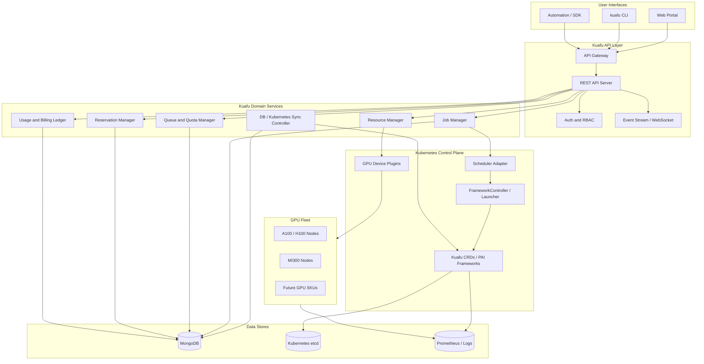
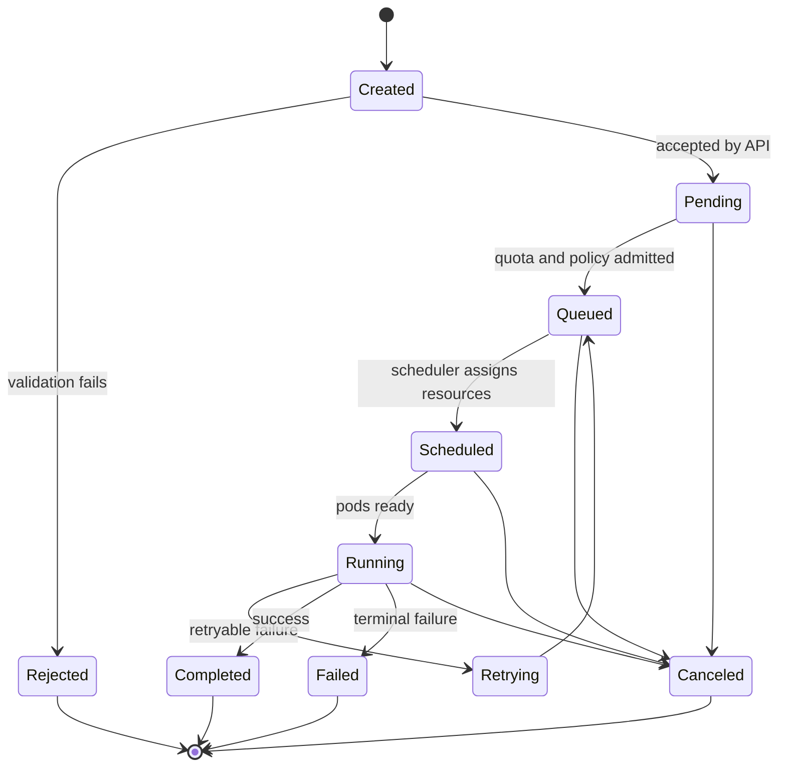

# Kuafu Design Draft

Status: Draft 0.1  
Date: 2026-06-24  
Authors: Kuafu PM, Kuafu Researcher, Kuafu GPU Architect, Kuafu Frontend Developer, Kuafu Backend Developer

> PM correction: the current in-memory E2E application is a lab prototype, not the target production system. Production Kuafu is Kubernetes-first. The active production plan is tracked in [production-roadmap.md](production-roadmap.md), with A00/A01 bootstrap details in [a00-a01-kubernetes-bootstrap.md](a00-a01-kubernetes-bootstrap.md).

## 1. Vision

Kuafu is a world-class Kubernetes-based GPU management platform for large heterogeneous GPU fleets. The initial target is a single large cluster with up to 4000 GPUs across SKUs such as NVIDIA A100/H100 and AMD MI300, serving multiple teams through queues, reservations, UI workflows, and HPC-style command-line tools.

Kuafu should feel familiar to users of LSF, PBS, and Slurm, while staying Kubernetes-native internally. Users submit batch or distributed jobs to queues, inspect status and logs, reserve GPUs for interactive use, and understand their usage and cost. Administrators manage queues, quotas, GPU inventory, health, reservations, and cluster-wide utilization.

The project should leverage the sample OpenPAI repo at `q:\gitroot\pai` where practical. OpenPAI is a mature Kubernetes-based AI platform with a modular architecture, a web portal, REST server, FrameworkController-based job orchestration, HiveD GPU scheduling, monitoring, storage, and a database-controller pattern. Kuafu should reuse ideas and, after validation, potentially reuse or fork components instead of rebuilding proven job launcher/scheduler machinery from scratch.

## 2. Product Scope

### Model-Serving Recipe Direction

Kuafu should treat high-quality model-serving recipes as a core product workflow. The SGLang GLM-5.2 cookbook is the current reference because it exposes hardware, precision, strategy, node count, image, command flags, benchmark context, and safe command generation in one place.

Initial GLM-5.2 recipes represented in Kuafu's catalog:

- H200 FP8 low-latency: `lmsysorg/sglang:latest`, TP8, EAGLE/MTP `5-1-6`, `--mem-fraction-static 0.8`, `--cuda-graph-max-bs 32`, port `30000`.
- H200 FP8 balanced: TP8 + DP8, DP-attention, DeepEP, EAGLE/MTP `1-1-2`, `--chunked-prefill-size 32768`, `--max-running-requests 80`.
- B300/GB300 NVFP4 low-latency: `lmsysorg/sglang:dev-glm52-nvfp4`, `nvidia/GLM-5.2-NVFP4`, TP4, `modelopt_fp4`, large chunked prefill.

Product rule: every generated command must be visible and editable before it can be submitted or recorded. This applies to job submission, model serving, reservation commands, workspace launch, and future admin actions.

### In Scope

- Kubernetes-based GPU fleet management.
- UI and CLI interfaces.
- Job submission, cancellation, status, logs, metrics, retry, and clone workflows.
- Queue and quota management.
- Resource inventory for nodes, GPUs, SKUs, MIG slices, health, topology, and allocation status.
- GPU reservations for interactive login or time-bounded exclusive use.
- Usage accounting for chargeback, credits, or future payment integration.
- Multi-tenant authentication, authorization, project membership, and audit logs.
- Integration with Kubernetes-native schedulers, controllers, device plugins, and observability systems.

### Non-Goals For The First Design Phase

- Building a new distributed job launcher before evaluating OpenPAI FrameworkController and other proven options.
- Building a custom container runtime.
- Replacing Kubernetes etcd or the Kubernetes API server.
- Implementing a full payment processor in the MVP. The MVP should track usage and reservation cost, then integrate with external billing later.
- Multi-cluster federation. Design should not block it, but the first target is one large cluster.

### Lab Prototype Boundary

The current Go API, CLI, dashboard, in-memory repository, and simulated scheduler exist only to validate user flows and developer ergonomics while the Kubernetes foundation is brought up.

Lab mode can remain useful for local development, but production behavior must replace it with:

- Kubernetes-backed runtime objects.
- NVIDIA GPU Operator or device plugin inventory.
- Scheduler adapter integration with FrameworkController/HiveD or a fallback such as Volcano.
- MongoDB-backed business records and audit history.
- Real job status/logs from Kubernetes, not simulated execution.

## 3. User Personas

### ML Engineer / Researcher

- Submits training and inference jobs.
- Needs predictable queue behavior, clear error messages, logs, metrics, and reproducible job specs.
- Wants CLI commands similar to `bsub`, `bjobs`, `sbatch`, `squeue`, and `qsub`.

### Interactive GPU User

- Reserves one or more GPUs for a fixed time window.
- Wants SSH, Jupyter, VS Code remote, or similar login workflows.
- Needs cost visibility before reserving.

### Cluster Administrator

- Manages queues, quotas, node health, GPU inventory, maintenance, and incidents.
- Needs utilization dashboards, audit logs, and safe drain/cordon/repair operations.

### Budget Owner

- Reviews GPU-hour usage by user, project, queue, and SKU.
- Needs chargeback reports and guardrails against waste.

## 4. Sample Project Findings: OpenPAI

The sample repo `q:\gitroot\pai` is useful as a reference and possible component source.

Key reusable ideas and components:

| Area | PAI component | Kuafu relevance |
| --- | --- | --- |
| Kubernetes platform | `docs/system_architecture.md`, deployment modules | Confirms the platform should assume Kubernetes and deploy services on top of it. |
| Job orchestration | `src/frameworkcontroller` | Candidate for distributed job launcher and gang-style job lifecycle. |
| GPU scheduling | `src/hivedscheduler` | Candidate scheduler for virtual clusters, topology reservation, priorities, and preemption. |
| API | `src/rest-server` | Reference for REST API shape and service decomposition. |
| UI | `src/webportal` | Reference for cluster/job portal structure. |
| DB/API synchronization | `docs/database_controller.md` | Important pattern for syncing database records to Kubernetes API resources through write merger, poller, and watcher. |
| Monitoring | Prometheus, Grafana, Fluentd, node exporter modules | Strong default observability stack. |
| CLI/admin | `paictl.py` | Reference for admin tooling, though Kuafu needs a user-facing HPC-style CLI. |

Important PAI lessons:

- OpenPAI v1 moved from Kubernetes plus YARN to Kubernetes-native architecture.
- FrameworkController handles job orchestration for OpenPAI protocol workloads.
- HiveD introduces virtual clusters that reserve GPUs by both quantity and topology, which matters for InfiniBand/NVLink training performance.
- The database-controller pattern treats database records as durable application records and synchronizes them to Kubernetes API objects.
- OpenPAI is stable/read-only, so direct reuse needs a fork/adaptation plan and ownership review.

## 5. Market Research Summary

Traditional HPC schedulers are useful UX references, but they are not the desired control plane.

| System | Strength | Kuafu decision |
| --- | --- | --- |
| Slurm | Mature HPC scheduling, accounting, familiar CLI | Emulate selected CLI concepts; do not make it the core scheduler. |
| OpenPBS | Mature queueing model | Emulate queue semantics where useful; not Kubernetes-native enough for Kuafu core. |
| LSF | Enterprise-grade reservations and policies | Emulate UX patterns; proprietary and not a core dependency. |
| OpenPAI | Full Kubernetes AI platform with FrameworkController and HiveD | Strongest reference and possible component source. |
| Volcano | Active Kubernetes batch scheduler with queues, gang scheduling, preemption | Strong candidate or fallback if HiveD reuse is too costly. |
| Kueue | Kubernetes SIG project for queue admission and resource flavors | Good admission/quota model, potentially useful with a scheduler underneath. |
| NVIDIA GPU Operator | NVIDIA driver/device plugin/MIG/DCGM management | Default for NVIDIA GPUs. |
| AMD GPU device plugin / ROCm stack | AMD GPU exposure and health | Required for MI300 support. |
| Run:ai | Advanced commercial GPU sharing and UX | Competitive benchmark, not an initial dependency. |
| Kubeflow / KubeRay | ML pipelines and distributed compute runtimes | Integrate later as workloads, not core GPU management. |

Research recommendation: start from Kubernetes-native components. Evaluate OpenPAI FrameworkController + HiveD first because the sample is local and aligned with the project vision. Keep Volcano/Kueue as serious alternatives or complementary components.

## 6. Architecture Principles

- Kubernetes API is the runtime source of truth for job and resource desired state.
- MongoDB is the authoritative source for user intent, business records, and queryable history.
- The sync controller ensures MongoDB intent becomes Kubernetes desired state, while Kubernetes runtime state updates MongoDB status.
- Scheduler integration is behind an adapter boundary.
- GPU resources are modeled explicitly, including SKU, memory, topology, health, MIG, allocation, reservations, and owner.
- UI, CLI, and API share the same backend contracts.
- Batch jobs and interactive reservations are first-class but separate workflows.
- Every state transition must be auditable and recoverable.
- Prefer proven components over custom distributed scheduling code.

## 7. High-Level Architecture



## 8. Component Design

### API Server

Recommended implementation: Go with `gin` or `echo`.

Responsibilities:

- Serve REST APIs for UI, CLI, and automation.
- Validate user requests and enforce RBAC.
- Create job, reservation, queue, quota, and project records.
- Emit real-time updates through WebSocket or server-sent events.
- Generate OpenAPI schemas for client and CLI compatibility.

Rationale: Go is the best fit for Kubernetes-native services because `client-go`, controller-runtime, Cobra, and Kubernetes testing utilities are strongest in Go.

### Job Manager

Responsibilities:

- Translate Kuafu job specs to the selected scheduler/launcher format.
- Own job lifecycle rules above Kubernetes primitives.
- Support retries, cancellation, clone, log lookup, metrics lookup, and failure classification.
- Persist job history and audit events in MongoDB.

Initial launcher strategy:

- Evaluate direct reuse of OpenPAI FrameworkController for distributed/gang job orchestration.
- Keep a scheduler adapter boundary so Kuafu can switch or add Volcano/Kueue later.

### Scheduler Adapter

The scheduler adapter hides implementation details from the API and UI.

Initial Go interface:

```go
package adapter

import (
  "context"
  "time"
)

type SchedulerAdapter interface {
  SubmitJob(ctx context.Context, req *JobSubmitRequest) (*JobSubmitResponse, error)
  CancelJob(ctx context.Context, schedulerJobID string) error
  GetJob(ctx context.Context, schedulerJobID string) (*JobRuntimeStatus, error)
  ListJobs(ctx context.Context, filter *JobFilter) ([]*JobRuntimeStatus, error)
  GetQueueStatus(ctx context.Context, queue string) (*QueueRuntimeStatus, error)
  GetResourceSnapshot(ctx context.Context, filter *ResourceFilter) (*ResourceSnapshot, error)
  ReserveResources(ctx context.Context, req *ReservationRequest) (*ReservationRuntimeStatus, error)
  ReleaseReservation(ctx context.Context, reservationID string) error
}

type JobSubmitRequest struct {
  JobID       string
  Queue       string
  GPUCount    int
  GPUSku      string
  Topology    TopologyConstraint
  Priority    int
  MaxRuntime  *time.Duration
  Preemptible bool
  Image       string
  Command     []string
  Env         map[string]string
}

type JobRuntimeStatus struct {
  SchedulerJobID string
  State          JobState
  AllocatedGPUs  []string
  StartTime      *time.Time
  EndTime        *time.Time
  FailureReason  string
}
```

Adapter behavior:

- `SubmitJob` blocks until the scheduler accepts or rejects the job; caller controls timeout through `context.Context`.
- Scheduler-specific metadata is stored under explicit adapter metadata fields, not leaked into the public API contract.
- HiveD adapter translates Kuafu jobs to OpenPAI Framework YAML / FrameworkController CRDs.
- Volcano adapter translates Kuafu jobs to Volcano Job CRDs.
- Kueue adapter translates Kuafu jobs to Kueue Workloads plus an execution backend.
- SKU compatibility is enforced in the adapter: CUDA-only jobs cannot land on AMD GPUs even when `gpuSku: any`.
- MVP gang scheduling requires homogeneous GPU SKU within one job allocation. Heterogeneous gang jobs are a post-MVP feature.

Candidate implementations:

- `pai-hived`: OpenPAI FrameworkController plus HiveD.
- `volcano`: Volcano queues and jobs.
- `kueue`: Kueue admission plus a scheduler backend.
- Future `slurm`/`pbs`/`lsf` adapters for migration or hybrid environments, not the core architecture.

### Resource Manager

Responsibilities:

- Maintain an indexed resource snapshot for GPUs, nodes, topology, health, and allocation.
- Normalize NVIDIA and AMD device plugin metadata.
- Track SKU labels such as `a100`, `h100`, `mi300`.
- Track MIG slices and fractional GPU availability where supported.
- Provide admin actions like cordon, drain, disable, repair-note, and maintenance windows.
- Manage MIG lifecycle: admins preconfigure MIG profiles through UI/CLI, Resource Manager applies them to drained GPUs, device plugins discover resulting slices, and scheduler adapters allocate them as separate resources.

GPU discovery and reconciliation:

- Inventory Controller watches Kubernetes node status and device plugin GPU advertisements.
- On node add/update, extract GPU UUIDs, vendor, SKU, memory, and runtime health, then upsert MongoDB inventory records.
- On node delete, mark GPUs `unknown` and alert if allocated or reserved.
- A periodic reconciliation loop compares Kubernetes-reported devices with MongoDB inventory, creates records for new UUIDs, marks missing UUIDs unknown, updates health changes, and resets stale allocations after a grace period when the owning job no longer exists.

Topology discovery:

- `rack` and `island` come from Kubernetes node labels such as `topology.kubernetes.io/zone`, `topology.kubernetes.io/rack`, or Kuafu admin labels.
- `nvlinkDomain` comes from node-local topology discovery such as `nvidia-smi topo -m` or DCGM.
- `infinibandDomain` comes from network annotations or an admin-maintained topology map.
- Inventory Controller validates discovered topology against admin-defined topology and alerts on mismatches.

### Queue And Quota Manager

Responsibilities:

- Define queues backed by virtual clusters or Kubernetes queue resources.
- Enforce user/project/team quotas by GPU SKU, count, memory, runtime, and priority.
- Support fair-share, priority, backfill, and preemption policies.
- Keep policy definitions auditable and versioned.

### Reservation Manager

Responsibilities:

- Reserve GPUs for interactive use or guaranteed future batch start.
- Support time windows, SKU constraints, node/topology constraints, and price estimates.
- Integrate with access services for SSH/Jupyter/VS Code remote sessions.
- Track cost, credits, and expiration.

### Usage And Billing Ledger

The MVP should not process real payments directly. It should provide accurate metering and cost records.

Responsibilities:

- Record GPU-hours by user, project, queue, job, reservation, and SKU.
- Support pricing tables and project credits.
- Emit reports for chargeback.
- Integrate with external payment or billing systems later.

### DB / Kubernetes Sync Controller

This follows the PAI database-controller pattern.

Responsibilities:

- Accept durable user intent in MongoDB.
- Create or update Kubernetes CRDs.
- Watch Kubernetes runtime state.
- Reconcile runtime status back into MongoDB.
- Recover after API/server/controller restarts.

Design rule:

- MongoDB wins for user intent and business records.
- Kubernetes wins for actual runtime state.
- Conflicts are resolved by explicit state machines, not ad hoc updates.

Reconciliation direction:

- User edits, such as job submit, queue create, reservation request, and quota update, go through Kuafu API and write MongoDB first.
- Sync Controller converts accepted MongoDB intent into Kubernetes CRDs, ConfigMaps, queue resources, or scheduler-specific objects.
- Kubernetes runtime state, such as pod phase, scheduler decision, allocation, and failure events, flows back from Kubernetes API watches into MongoDB status fields.
- MongoDB owns spec; Kubernetes owns status. Direct Kubernetes edits to Kuafu-managed spec objects are overwritten unless explicitly imported by an admin workflow.

## 9. Data Ownership: MongoDB vs Kubernetes etcd

| Data | Primary owner | Reason |
| --- | --- | --- |
| Job request, original spec, user metadata | MongoDB | Durable user/business record; queryable history. |
| Job runtime state, pods, controller state | Kubernetes API / etcd | Native runtime authority and watch semantics. |
| Job history and audit events | MongoDB | Long-term history should not bloat etcd. |
| Queue policy and quota definitions | MongoDB authoritative, generated K8s objects | Queue create/update goes through Kuafu API and MongoDB; Sync Controller generates K8s Queue or VirtualCluster objects. Direct K8s edits are overwritten. |
| Scheduler internals | Kubernetes / scheduler backend | Runtime scheduling details belong near scheduler. |
| GPU inventory live state | Kubernetes nodes/device plugins | Physical cluster state is discovered by Kubernetes. |
| GPU administrative metadata | MongoDB | Admin-defined SKU labels, topology, maintenance state, MIG intent, and historical health must persist across node replacements. |
| GPU inventory query cache | MongoDB | Fast UI/CLI queries and historical changes. |
| Reservations | MongoDB plus generated runtime guards | Business/time/payment semantics are application-level. |
| Users, projects, credits, payment records | MongoDB | Product domain data. |
| Secrets | Kubernetes Secrets or external secret manager | Avoid storing credentials in MongoDB. |

Why not store everything in MongoDB:

- Kubernetes controllers and schedulers need Kubernetes objects.
- etcd has strong consistency and watch semantics for runtime changes.
- MongoDB should not be the direct scheduler state machine.

Why not store everything in etcd:

- etcd is not designed for rich historical job queries, billing reports, or large audit history.
- Large job histories and usage ledgers can harm Kubernetes control-plane health.

## 10. Core Resource Model

```yaml
gpu:
  id: string
  vendor: nvidia | amd
  sku: a100 | h100 | mi300 | other
  memoryGiB: number
  nodeName: string
  uuid: string
  health: healthy | degraded | failed | unknown
  allocationState: free | queued | allocated | reserved | maintenance | unknown
  currentJobId: string?
  reservationId: string?
  topology:
    rack: string?
    island: string?
    nvlinkDomain: string?
    infinibandDomain: string?
  mig:
    enabled: boolean
    profile: string?
    parentGpuId: string?
```

Storage rule: device plugins report UUID, vendor, memory, runtime health, and allocatable devices to Kubernetes. MongoDB stores authoritative admin metadata: SKU classification, rack/island/NVLink/InfiniBand topology, maintenance state, MIG configuration intent, and historical health. Resource Manager reconciles both sources: MongoDB defines what GPUs should look like; Kubernetes reports what actually exists.

MIG handling:

- `mig.enabled=true` means a parent GPU is partitioned into slices.
- Each MIG slice appears as a separate GPU record with `mig.parentGpuId` pointing to the parent GPU.
- Example profile names include `1g.5gb`, `2g.10gb`, `3g.20gb`, `4g.20gb`, and `7g.40gb`, with SKU-specific equivalents for newer NVIDIA GPUs. AMD partitioning support is tracked separately through ROCm/device-plugin capabilities.
- Jobs request MIG by explicit SKU such as `a100-1g.5gb`, or by `gpuSku: a100` plus `gpuMemoryGiB` when scheduler support can safely choose a slice.
- MIG reconfiguration requires drain and reset of the affected GPU; dynamic on-demand MIG creation is not in the MVP until proven safe.

```yaml
job:
  id: string
  name: string
  userId: string
  projectId: string
  queue: string
  state: created | pending | queued | scheduled | running | retrying | completed | failed | canceled | rejected
  resources:
    gpuSku: string | any
    # Valid examples: a100, h100, mi300, a100-1g.5gb, any.
    # any means the runtime is truly SKU-agnostic. CUDA-only workloads must not use AMD GPUs.
    gpuCompatibility: string[]? # Examples: cuda, rocm
    gpuCount: number
    gpuMemoryGiB: number?
    topology: same-node | same-rack | same-island | any
    cpu: string?
    memory: string?
  runtime:
    image: string
    command: string[]
    env: map
    volumes: list
  policy:
    priority: number
    maxRuntime: duration?
    retryLimit: number
    preemptible: boolean
```

## 11. Job Lifecycle



Every transition should produce an audit event and update both the user-facing job record and the runtime state as appropriate.

## 12. CLI Design

The CLI should be a Go binary using Cobra. It should support Kuafu-native command groups and optional compatibility aliases for HPC users.

Native command groups:

```text
kuafu auth login
kuafu job submit -f job.yaml --queue training
kuafu job list --queue training --state running
kuafu job info <job-id>
kuafu job cancel <job-id>
kuafu job logs <job-id> --follow

kuafu resource gpu list --sku a100 --state free
kuafu resource node list
kuafu resource node drain <node-name>
kuafu resource topology

kuafu queue list
kuafu queue create <name> --quota a100=64,mi300=32
kuafu queue set-quota <name> --gpu a100=128

kuafu reserve create --sku a100 --count 4 --duration 8h
kuafu reserve list
kuafu reserve login <reservation-id>
kuafu reserve cancel <reservation-id>

kuafu project create <name>
kuafu project quota <name>
kuafu billing usage --project <name> --month 2026-06
```

Compatibility wrappers can map familiar commands:

| Familiar command | Kuafu equivalent |
| --- | --- |
| `bsub` / `qsub` / `sbatch` | `kuafu job submit` |
| `bjobs` / `qstat` / `squeue` | `kuafu job list` |
| `bkill` / `qdel` / `scancel` | `kuafu job cancel` |
| `bqueues` / `sinfo` | `kuafu queue list` or `kuafu resource` |

The CLI should use the same REST/OpenAPI contract as the UI.

## 13. UI Design

Recommended implementation: React + TypeScript + Vite.

Primary screens:

- Dashboard: cluster health, GPU utilization by SKU, queue summary, active jobs, reservations, cost summary.
- Job list: filterable table by user, project, queue, status, SKU, time range.
- Job submission wizard: queue selection, GPU/SKU request, YAML/JSON editor, validation, review, submit.
- Job detail: timeline, pods/tasks, logs, metrics, allocated GPUs, retry/cancel/clone actions.
- Resource explorer: cluster/node/GPU tree, SKU filters, health, topology, reservation calendar.
- Reservation flow: select SKU/count/time, estimate price, confirm, show access instructions.
- Admin queue management: quotas, priorities, fair-share policy, users/groups.
- Admin node management: drain/cordon/maintenance actions.
- Usage and billing: GPU-hour summaries, project reports, reservation charges.

Frontend contract needs:

- Typed OpenAPI-generated client.
- Real-time job/resource streams through WebSocket or server-sent events.
- Stable enum values for job, GPU, node, queue, and reservation states.
- Pagination and server-side filtering for large tables.
- Virtualized resource and job tables for 4000-GPU scale.

Real-time event stream contract:

- MVP protocol: server-sent events on `/api/events`. WebSocket can be added later for bidirectional control.
- Event types include `job.state_change`, `job.log`, `gpu.health_change`, `queue.utilization`, and `reservation.state_change`.
- Event shape:

```json
{
  "id": "event-123",
  "type": "job.state_change",
  "timestamp": "2026-06-24T12:34:56Z",
  "resourceId": "job-abc123",
  "data": {}
}
```

- Events are ordered per `resourceId`; cross-resource ordering is not guaranteed.
- Client reconnects with `Last-Event-ID`; server keeps a short replay window and tells clients to refetch full state if a gap is detected.

Pagination contract:

- Use cursor-based pagination for jobs, GPUs, nodes, reservations, and audit events.
- Request shape: `GET /api/jobs?limit=50&cursor=<opaque_token>`.
- Response shape:

```json
{
  "items": [],
  "nextCursor": "opaque-token",
  "hasMore": true
}
```

- Default limit is 50 and maximum limit is 500.
- Stable sort is by creation timestamp descending and ID ascending unless an endpoint documents a different sort.

## 14. Backend Language And Framework Choices

| Layer | Choice | Rationale |
| --- | --- | --- |
| Controllers/operators | Go | Best Kubernetes ecosystem support. |
| REST API | Go | Shared types, performance, simple deployment, Kubernetes integration. |
| CLI | Go + Cobra | Matches Kubernetes ecosystem and supports a single portable binary. |
| Web UI | TypeScript + React + Vite | Strong UI typing and modern build speed. |
| API schema | OpenAPI 3 | Generates UI/CLI clients and docs. |
| Database | MongoDB | Flexible job/reservation/billing documents and rich queries. |
| Event stream | NATS or Redis Streams in MVP | Decouple job status and live updates. |
| Metrics | Prometheus + Grafana | Kubernetes-native observability. |
| Logs | Loki or Elasticsearch via Fluentd/Fluent Bit | Job and system log search. |

Node.js remains a useful reference because OpenPAI uses it for `rest-server` and `webportal`, but Kuafu's Kubernetes controllers, core API, and CLI should be Go-first.

## 15. MVP Architecture Decisions

### ADR-001: Kubernetes Is The Runtime Control Plane

Decision: Kuafu runs on Kubernetes and represents runtime jobs/resources through Kubernetes objects and CRDs.

Reason: This aligns with the project requirement, OpenPAI's v1 architecture, and current GPU ecosystem tooling.

### ADR-002: Reuse Or Fork OpenPAI Launcher/Scheduler Before Rebuilding

Decision: Evaluate OpenPAI FrameworkController and HiveD as first-class candidates for job orchestration and GPU scheduling.

Reason: They directly address distributed job launching, gang scheduling, virtual clusters, topology-aware GPU placement, priorities, and preemption.

Open item: compare against Volcano/Kueue with a proof of concept.

### ADR-003: MongoDB Stores Business Records; Kubernetes Stores Runtime State

Decision: Use MongoDB for jobs, history, users, projects, queues, reservations, billing, and audit records. Use Kubernetes/etcd for runtime objects and scheduler state.

Reason: This balances developer-friendly queryability with Kubernetes-native correctness.

### ADR-004: Go Is The Core Backend And CLI Language

Decision: Implement core backend services, controllers, scheduler adapters, and CLI in Go.

Reason: Go is the strongest language for Kubernetes controllers and operational CLIs.

### ADR-005: React + TypeScript For UI

Decision: Implement UI in React + TypeScript + Vite.

Reason: It supports complex typed workflow state, high-quality dashboards, and a strong component ecosystem.

## 16. Scale And Reliability Plan

Scale target: 4000 GPUs, likely hundreds of nodes, multiple GPU SKUs, and 100+ concurrent active users.

Current proof-of-concept testbed: A00 and A01 are documented in [testbed-a00-a01.md](testbed-a00-a01.md). They provide two Ubuntu 22.04 nodes with 16 total NVIDIA A100-SXM4-80GB GPUs, Docker GPU runtime, active InfiniBand, and cross-node connectivity. Kubernetes is not installed yet, so the first cluster milestone must include Kubernetes bootstrap and GPU device plugin validation.

Required design choices:

- Avoid storing high-volume history in etcd.
- Use MongoDB indexes and retention policies for jobs, reservations, usage, and audit.
- Use server-side pagination and filtering for all list APIs.
- Cache resource snapshots for UI/CLI reads while preserving Kubernetes as runtime authority.
- Use controller reconciliation instead of one-shot imperative updates.
- Partition metrics/logs by cluster, node, queue, project, and SKU.
- Load-test scheduler behavior with simulated nodes before selecting HiveD, Volcano, or a hybrid.
- Define SLOs for API latency, job admission latency, scheduler latency, event freshness, and controller recovery time.

Initial SLO targets:

- CLI/API read p95 under 500 ms for common list/detail calls with pagination.
- Job submit API p95 under 1 second excluding scheduler wait.
- Resource snapshot freshness under 10 seconds.
- Controller recovery from restart under 2 minutes for normal load.
- Scheduler scale test: 4000 GPUs represented without control-plane degradation.

## 17. Security And Multi-Tenancy

Security requirements:

- OIDC/OAuth2 login, with LDAP/AD integration if needed.
- Project and queue RBAC.
- Kubernetes namespace isolation per project or queue where practical.
- Secrets stored in Kubernetes Secrets or an external secret manager, not plain MongoDB documents.
- Audit all admin operations, job submissions, cancellations, quota changes, reservations, and payment events.
- Enforce quota and reservation authorization server-side, not only in UI.
- Support image allowlists and admission policies for production clusters.

## 18. Observability

Kuafu should expose three observability views:

- User view: job status, logs, failure reason, GPU utilization, cost.
- Admin view: GPU health, queue utilization, scheduler latency, node status, component health.
- Platform view: API latency, controller reconciliation lag, MongoDB latency, Kubernetes API errors, event-stream lag.

Recommended stack:

- Prometheus for metrics.
- Grafana for dashboards.
- DCGM exporter for NVIDIA GPU metrics.
- AMD/ROCm exporter for MI300 metrics where available.
- Fluent Bit or Fluentd plus Loki/Elasticsearch for logs.

## 19. Initial Milestones

### M1: Design And Feasibility

- Complete this design document.
- Build proof-of-concept for OpenPAI FrameworkController/HiveD or Volcano/Kueue.
- Decide scheduler/launcher MVP path.
- Define OpenAPI draft and CRD draft.

### M2: Core API, CLI, And Data Model

- Scaffold Go API server.
- Scaffold Cobra CLI.
- Define MongoDB collections and indexes.
- Implement auth stub, projects, queues, and job submission skeleton.

### M3: Kubernetes Runtime Integration

- Implement sync controller.
- Create first job CRD or FrameworkController integration.
- Watch job state and mirror status to MongoDB.
- Support cancel/status/logs through CLI.

### M4: UI MVP

- Implement dashboard, job list, submit job, job detail, resource explorer.
- Integrate typed API client.
- Add real-time job status stream.

### M5: Reservations And Usage Accounting

- Implement reservation records and runtime guards.
- Add reservation UI and CLI.
- Add GPU-hour usage ledger and project reports.

### M6: Scale And Production Hardening

- Simulate 4000 GPUs.
- Load test job submission and resource inventory.
- Add HA deployment docs, monitoring, audit, backup, and recovery plans.

## 20. Design Document Acceptance Criteria

This document is ready for implementation planning when:

- PM confirms product scope, milestones, personas, and non-goals.
- Researcher confirms PAI reuse candidates, market alternatives, and license/reuse risks.
- GPU Architect approves component boundaries and MongoDB/Kubernetes ownership.
- Frontend Developer confirms UI workflows and API contract needs.
- Backend Developer confirms language stack, service boundaries, data model, and test plan.
- At least one scheduler/launcher proof-of-concept plan is documented.
- Open questions below are resolved or assigned.

## 21. Open Questions

1. Should the MVP use OpenPAI FrameworkController + HiveD directly, or should it use Volcano/Kueue and only borrow PAI patterns?
2. Which compatibility style should the first CLI prioritize: LSF, PBS, Slurm, or Kuafu-native with aliases?
3. Should interactive reservation login provide SSH, Jupyter, VS Code remote, web terminal, or multiple options?
4. Is real payment required in the first release, or only usage accounting and internal credits?
5. Should MongoDB be mandatory, or should PostgreSQL remain an option because OpenPAI already uses it?
6. What is the first deployment environment: on-prem Kubernetes, AKS, or both?
7. Is AMD MI300 support required in the MVP or in the first post-MVP milestone?
8. What is the first target workload shape: single-container jobs, distributed training jobs, MPI jobs, Ray jobs, or all of them?
9. Should Kuafu define its own job spec, adopt OpenPAI protocol, or support both through translation?
10. What are the expected quota and pricing rules for reservations?

## 22. Immediate Next Steps

- Researcher: deep-dive PAI FrameworkController, HiveD, and database-controller integration surfaces.
- GPU Architect: produce a proof-of-concept plan comparing PAI reuse against Volcano/Kueue.
- Backend Developer: draft OpenAPI resources and MongoDB collection/index design.
- Frontend Developer: draft UI information architecture and job submission/reservation wireframes.
- PM: decide MVP command compatibility target and define release-one acceptance criteria.
